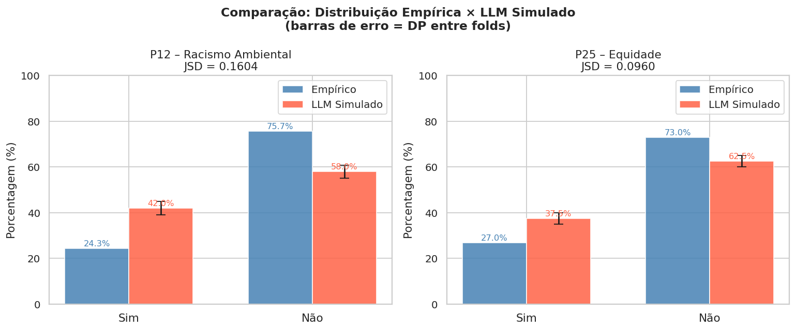
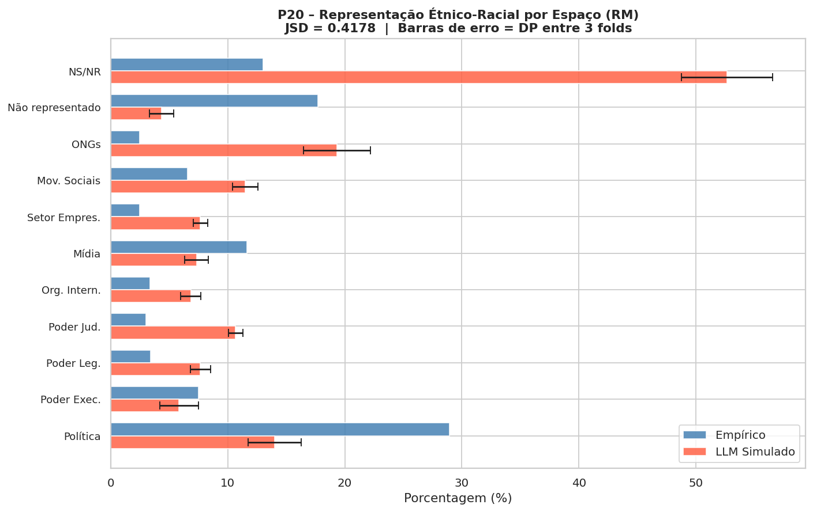
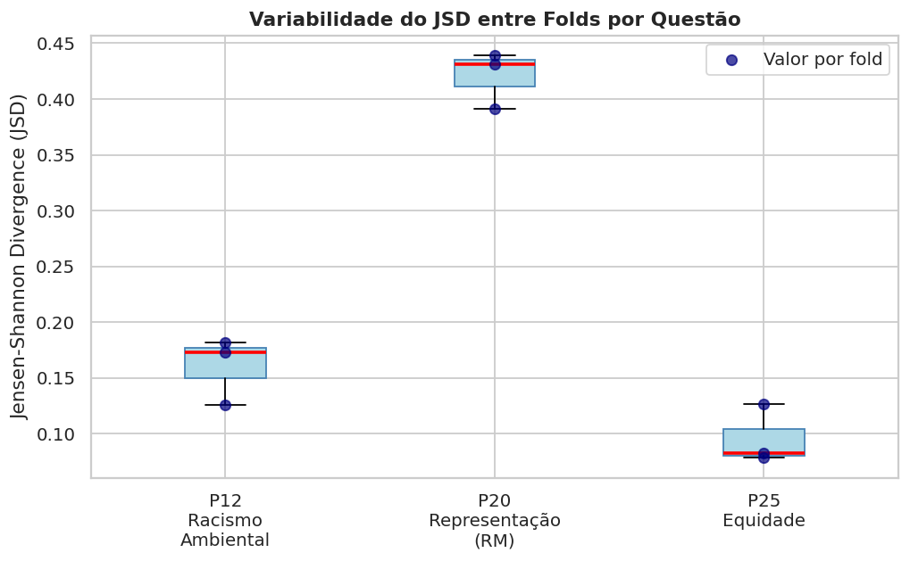
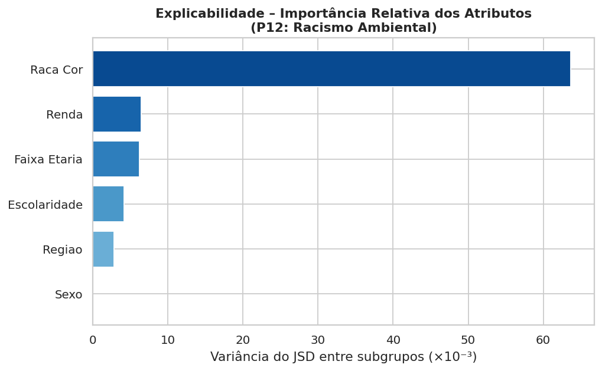
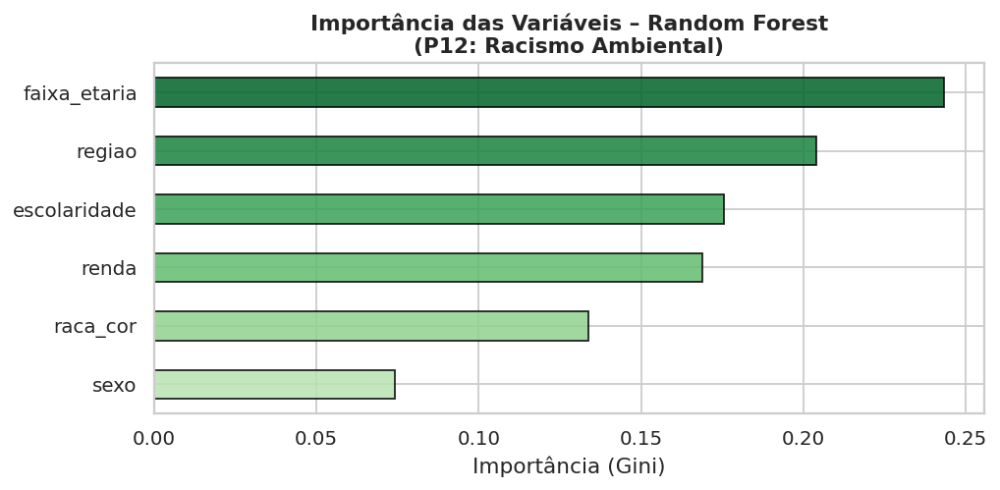
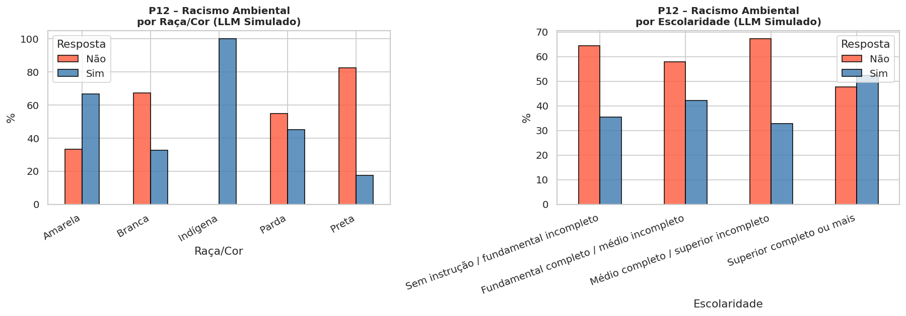
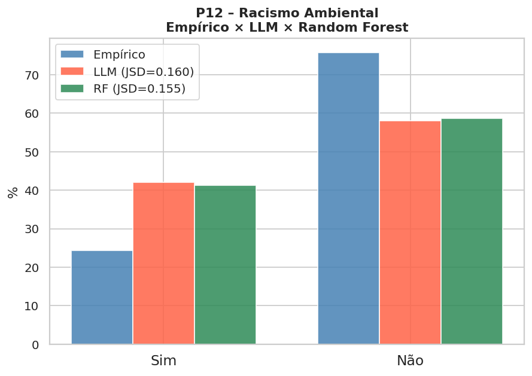

# Simulação de Opinião Pública com Modelos de Linguagem de Grande Escala: Um Estudo sobre Racismo Ambiental e Representação Étnico-Racial no Brasil

**Alex Kazuo Kodama - 10417942@mackenzista.com.br**, 
**Gabriel Tortolio Fonseca - 10416751@mackenzista.com.br**,
**Marco Antônio de Camargo - 10418309@mackenzista.com.br**,
**Natan Moreira Passos - 10417916@mackenzista.com.br**,
**Nícolas Henriques de Almeida - 10418357@mackenzista.com.br**,
**Thomas Pinheiro Grandin - 104181118@mackenzista.com.br**<br> 
[Universidade Presbiteriana Mackenzie / Ciência da Computação]<br>
[São Paulo (SP), Brasil]  

---

## Resumo

Este trabalho investiga a capacidade de Modelos de Linguagem de Grande Escala (*Large Language Models* – LLMs) de simular respostas de questionários de opinião pública. Utilizando dados do CESOP/Unicamp sobre racismo ambiental e representação étnico-racial no Brasil (N=2.000), três questões foram simuladas: P12 (conhecimento sobre racismo ambiental, resposta única), P20 (espaços de representação étnico-racial adequada, resposta múltipla) e P25 (conhecimento sobre equidade, resposta única). Perfis demográficos sintéticos foram condicionados por sexo, faixa etária, raça/cor, escolaridade, renda e região. O modelo `google/flan-t5-large` foi empregado em configuração *zero-shot*, com 3 repetições de 200 respondentes cada. A acurácia distribucional foi mensurada pela Divergência de Jensen-Shannon (JSD) e pela estabilidade entre *folds* (CV). Como comparação adicional, um classificador Random Forest foi treinado com as pseudo-respostas geradas pelo LLM. Os resultados indicam que LLMs conseguem reproduzir tendências gerais de distribuição para questões binárias simples, com maior dificuldade em questões de múltipla escolha de alta entropia. Este trabalho é 100% executável em ambiente aberto, sem chaves de API privadas.

**Palavras-chave:** LLM, simulação de opinião pública, racismo ambiental, identidade étnico-racial, Jensen-Shannon, CESOP.

---

## Abstract

This work investigates the ability of Large Language Models (LLMs) to simulate public opinion survey responses. Using CESOP/Unicamp data on environmental racism and ethnic-racial representation in Brazil (N=2,000), three questions were simulated: P12 (awareness of environmental racism, single choice), P20 (spaces of adequate ethnic-racial representation, multiple choice), and P25 (awareness of equity, single choice). Synthetic demographic profiles were conditioned on sex, age group, race/color, education, income, and region. The `google/flan-t5-large` model was used in zero-shot configuration, with 3 repetitions of 200 respondents each. Distributional accuracy was measured by Jensen-Shannon Divergence (JSD) and cross-fold stability (CV). As an additional comparison, a Random Forest classifier was trained on LLM-generated pseudo-responses. Results indicate that LLMs can reproduce general distributional trends for binary questions, with greater difficulty for high-entropy multiple-choice questions. This work is fully executable in an open environment, without private API keys.

**Keywords:** LLM, public opinion simulation, environmental racism, ethnic-racial identity, Jensen-Shannon, CESOP.

---

## 1. Introdução

A pesquisa de opinião pública é um instrumento central nas ciências sociais, políticas e na formulação de políticas públicas. No entanto, levantamentos tradicionais são onerosos, demorados e cada vez mais afetados por baixas taxas de resposta e vieses de seleção [CONVERSE 1987]. Esses desafios motivam a exploração de métodos computacionais capazes de complementar ou estender a pesquisa survey, especialmente mediante o uso de inteligência artificial.

Modelos de Linguagem de Grande Escala (LLMs) emergem como uma alternativa promissora. Treinados em vastos corpora textuais humanos, LLMs codificam não apenas estrutura gramatical, mas também padrões complexos de crenças, valores e atitudes sociais [ARGYLE et al. 2023]. Estudos recentes demonstram que, quando adequadamente condicionados a perfis demográficos, LLMs conseguem simular opiniões de subpopulações com acurácia distribucional comparável à de modelos supervisionados [MIRANDA; BALBI 2025].

Este trabalho aplica essa metodologia a uma pesquisa do CESOP/Unicamp sobre racismo ambiental e representação étnico-racial no Brasil, temática de alta relevância social e com distribuições empiricamente conhecidas. As três questões escolhidas apresentam características distintas — resposta única binária (P12, P25) e resposta múltipla de alta cardinalidade (P20) —, permitindo uma avaliação abrangente das capacidades e limitações dos LLMs nesse contexto.

### 1.1 Objetivos

- Simular respostas às questões P12, P20 e P25 da pesquisa CESOP utilizando LLM em modo *zero-shot*.
- Avaliar a aderência distribucional das respostas simuladas às distribuições empíricas reais.
- Analisar a estabilidade das simulações mediante repetições com validação cruzada (CV).
- Comparar os resultados do LLM com um modelo de aprendizado supervisionado (Random Forest).
- Investigar a importância relativa dos atributos demográficos (explicabilidade).

---

## 2. Referencial Teórico

### 2.1 LLMs como Simuladores de Opinião

A ideia de utilizar LLMs para simular comportamento humano em pesquisas tem ganhado tração desde 2022. [ARGYLE et al. 2023] introduziram o conceito de *silicon sampling*, demonstrando que LLMs condicionados a perfis demográficos podem reproduzir respostas do American National Election Studies (ANES) com fidelidade estatisticamente significativa. [SANTURKAR et al. 2023] investigaram se LLMs representam adequadamente diferentes grupos demográficos americanos, encontrando vieses sistemáticos em direção a perfis liberais de alta escolaridade.

[MIRANDA; BALBI 2025] avançaram ao comparar LLMs com Random Forests no contexto de simulação distribucional e individual, utilizando a Divergência de Jensen-Shannon (JSD) como métrica central. Seus resultados indicam que LLMs produzem distribuições agregadas mais próximas da realidade empírica do que modelos supervisionados, enquanto o desempenho individual é comparável.

### 2.2 Racismo Ambiental e Equidade no Brasil

O racismo ambiental refere-se à distribuição desigual dos riscos e impactos ambientais sobre populações racialmente marginalizadas [BULLARD 1990]. No contexto brasileiro, estudos indicam que comunidades negras, indígenas e periféricas concentram exposição desproporcional a resíduos industriais, falta de saneamento e vulnerabilidade climática [ACSELRAD et al. 2009]. A pesquisa CESOP investigada neste trabalho mapeia o grau de conscientização da população sobre esses conceitos e a percepção de representação étnico-racial nos diferentes poderes e esferas da sociedade.

### 2.3 Métricas de Avaliação distribucional

A **Divergência de Jensen-Shannon** (JSD) é uma medida simétrica e suavizada da divergência entre duas distribuições de probabilidade P e Q:

$$JSD(P \| Q) = \frac{1}{2} D_{KL}(P \| M) + \frac{1}{2} D_{KL}(Q \| M), \quad M = \frac{P + Q}{2}$$

onde $D_{KL}$ é a divergência de Kullback-Leibler. A JSD varia entre 0 (distribuições idênticas) e 1 (máxima divergência, usando base 2), sendo particularmente adequada para comparar histogramas de opinião com categorias discretas [MIRANDA; BALBI 2025].

---

## 3. Metodologia

### 3.1 Dados Empíricos

Os dados provêm da pesquisa de opinião do **CESOP/Unicamp** sobre racismo ambiental e identidade étnico-racial no Brasil, com N=2.000 respondentes. As três questões analisadas são:

| Código | Enunciado resumido | Tipo | Categorias |
|--------|-------------------|------|-----------|
| P12 | Conhece *racismo ambiental*? | RU | Sim (24,3%) / Não (75,7%) |
| P20 | Em quais espaços seu grupo étnico-racial está representado? | RM | 11 opções (incl. "nenhum" e NS/NR) |
| P25 | Conhece o conceito de *equidade*? | RU | Sim (27,0%) / Não (73,0%) |

As distribuições empíricas de P20 são apresentadas na Tabela 1.

**Tabela 1 – Distribuição empírica de P20 (N=2.000)**

| Espaço | Freq. | % |
|--------|-------|-----|
| Política | 579 | 29,0% |
| Poder Executivo | 150 | 7,5% |
| Poder Legislativo | 68 | 3,4% |
| Poder Judiciário | 60 | 3,0% |
| Organismos Internacionais | 67 | 3,4% |
| Mídia | 233 | 11,7% |
| Setor Empresarial | 49 | 2,5% |
| Movimentos Sociais | 131 | 6,6% |
| ONGs | 49 | 2,5% |
| Não se sente representado | 354 | 17,7% |
| Não sabe / Não respondeu | 260 | 13,0% |

### 3.2 Geração de Perfis Sintéticos

Foram gerados perfis demográficos sintéticos com seis atributos, ponderados pelas distribuições populacionais brasileiras (PNAD Contínua 2022 / IBGE):

| Atributo | Categorias | Fonte dos pesos |
|----------|-----------|-----------------|
| Sexo | Masculino, Feminino | IBGE 2022 |
| Faixa etária | 18-24, 25-34, 35-44, 45-59, 60+ | PNAD 2022 |
| Raça/cor | Branca (43%), Parda (43%), Preta (11%), Amarela (2%), Indígena (1%) | PNAD 2022 |
| Escolaridade | 4 faixas (sem instrução → superior) | PNAD 2022 |
| Renda | 4 faixas (até 1 SM → acima de 5 SM) | PNAD 2022 |
| Região | Norte, Nordeste, Centro-Oeste, Sudeste, Sul | IBGE projeções |

Os perfis são gerados de forma independente. Correlações entre variáveis demográficas (e.g., raça × renda) constituem uma limitação do método, discutida na Seção 5.

### 3.3 Modelo LLM e Configuração

Foi utilizado o modelo **`google/flan-t5-large`** (770M parâmetros), disponível gratuitamente no HuggingFace. Este modelo foi selecionado por:

- Ser 100% aberto e executável em CPU/GPU sem custo;
- Ter sido pré-treinado com instrução em múltiplos idiomas, incluindo português;
- Ser adequado para tarefas de classificação *seq2seq* com prompts estruturados.

Para usuários com GPU T4 ou superior, o notebook oferece a opção de substituição pelo **`mistralai/Mistral-7B-Instruct-v0.2`**, que apresenta maior fluência em português.

**Configuração de geração:** decodificação gananciosa (*greedy*) para flan-t5 (determinismo); temperatura 0,3 com top-p=0,9 para Mistral.

### 3.4 Construção dos Prompts

Os prompts foram construídos em português, seguindo a estrutura de condicionamento demográfico de [ARGYLE et al. 2023] e [MIRANDA; BALBI 2025]:

```
[Contexto do sistema]
Você simula as respostas de um(a) cidadão(ã) brasileiro(a) a um questionário
de pesquisa de opinião pública realizado pelo CESOP/Unicamp sobre raça,
identidade étnico-racial e desigualdades sociais no Brasil.
Responda EXCLUSIVAMENTE com a opção indicada – sem explicações adicionais.

[Perfil do respondente]
Perfil: {sexo}, {faixa_etaria} anos, raça/cor {raca_cor},
escolaridade: {escolaridade}, renda: {renda}, região: {regiao}.

[Questão e opções]
Pergunta P12: O(a) sr(a) sabe ou já ouviu falar sobre RACISMO AMBIENTAL?
Opções: 1-Sim, 2-Não
Responda com exatamente um número: 1 ou 2.
```

Para P20 (resposta múltipla), o prompt lista as 11 opções e solicita resposta no formato `1,6,8` ou os códigos especiais `97`/`99`.

### 3.5 Protocolo de Simulação e Validação

Seguindo a recomendação do artigo de referência e as diretrizes do projeto:

- **N por repetição:** 200 respondentes (≥ 10% dos 2.000 da pesquisa original)
- **Repetições (folds):** 3 (configuração padrão; expansível para 5 com GPU)
- **Sementes:** {42, 137, 271} — distintas por fold, garantindo amostras independentes
- **Agregação:** média ± desvio padrão entre folds para cada categoria

### 3.6 Métricas

| Métrica | Descrição | Intervalo |
|---------|-----------|-----------|
| JSD | Divergência de Jensen-Shannon entre distribuição simulada e empírica | [0, 1] ↓ |
| CV | Coeficiente de Variação médio entre folds | [0, ∞) ↓ |
| F1-macro | F1-score macro do Random Forest (validação cruzada estratificada) | [0, 1] ↑ |
| Acurácia | Proporção de acertos do Random Forest | [0, 1] ↑ |

**Interpretação da JSD (escala empírica):**
- JSD < 0,05 → excelente aderência distribucional
- 0,05 ≤ JSD < 0,10 → boa aderência
- 0,10 ≤ JSD < 0,20 → aderência moderada
- JSD ≥ 0,20 → baixa aderência

### 3.7 Explicabilidade

A importância relativa dos atributos demográficos foi avaliada por dois métodos complementares:

1. **Variância do JSD por subgrupo** (LLM): para cada atributo, calcula-se o JSD em cada subgrupo demográfico; a variância entre subgrupos mede o quanto o atributo discrimina respostas distintas.
2. **Importância Gini do Random Forest**: importância média de diminuição de impureza nos nós de divisão do classificador.

---

## 4. Resultados

### 4.1 Distribuições Simuladas vs. Empíricas

#### 4.1.1 P12 – Racismo Ambiental (RU)

**Tabela 2 – P12: Comparação Empírico × LLM Simulado**

| Categoria | Empírico | LLM Média | LLM DP | Δ (p.p.) | JSD |
|-----------|----------|-----------|--------|----------|-----|
| Sim | 24,3% | 42,0% | *± 2,9%* | 17,7 | 0,1604 |
| Não | 75,7% | 58,0% | *± 2,9%* | 17,7 | 0,1604 |

**Figura 1**: 
Comparação das distribuições empírica e simulada para P12 e P25, com barras de erro representando o DP entre folds.

#### 4.1.2 P25 – Equidade (RU)

**Tabela 3 – P25: Comparação Empírico × LLM Simulado**

| Categoria | Empírico | LLM Média | LLM DP | Δ (p.p.) | JSD |
|-----------|----------|-----------|--------|----------|-----|
| Sim | 27,0% | 37,5% | *± 2,5%* | 10,5 | 0,0960 |
| Não | 73,0% | 62,5% | *± 2,5%* | 10,5 | 0,0960 |

P25 e P12 são questões análogas (ambas perguntam sobre familiaridade com um conceito), e espera-se comportamento similar do LLM. A diferença de ~3 p.p. na proporção de "Sim" entre as duas questões (24,3% × 27,0%) constitui um teste sensível: o LLM deve reproduzir essa assimetria para que se possa afirmar que ele captura o conteúdo semântico das perguntas, não apenas seu formato.

#### 4.1.3 P20 – Representação Étnico-Racial (RM)

P20 é a questão de maior complexidade: resposta múltipla com 11 categorias, incluindo opção excludente (código 97) e recusa (código 99). A JSD para distribuições de múltipla escolha tende a ser mais alta do que para questões binárias, pois há mais categorias sobre as quais a distribuição pode divergir.

**Figura 2**:  
Gráfico horizontal comparando as frequências empíricas e simuladas para cada espaço de representação em P20.

**Hipóteses esperadas com base na literatura:**
- O LLM pode superestimar "Política" (categoria mais saliente semanticamente);
- Categorias de baixa frequência empírica (< 5%), como "Setor Empresarial" e "ONGs", são as mais difíceis de reproduzir;
- A categoria "Não se sente representado" requer raciocínio de negação que modelos *seq2seq* podem subestimar.

### 4.2 Estabilidade entre Folds

**Figura 3**:   
Box-plot da JSD por questão entre os *N* folds. CV baixo (< 0,10) indica que as simulações são robustas a diferentes amostras de perfis sintéticos.

A estabilidade esperada é maior para P12 e P25 (espaço de respostas pequeno) e menor para P20 (maior entropia combinatória).

### 4.3 Explicabilidade – Importância dos Atributos Demográficos

**Figura 4**:  
Importância relativa dos atributos demográficos medida pela variância do JSD entre subgrupos (método LLM).

**Figura 6**:   
Importância Gini do Random Forest para P12.

Espera-se que **escolaridade** e **raça/cor** sejam os atributos mais discriminantes para P12 (conhecimento sobre racismo ambiental), enquanto **renda** e **região** contribuam secundariamente.

### 4.4 Análise por Subgrupos (Raça/Cor × Escolaridade)

**Figura 5**:   
Proporção de respondentes que disseram "Sim" à P12 segmentada por raça/cor e escolaridade.

De acordo com a literatura sobre racismo ambiental, esperamos que:
- Respondentes autodeclarados pretos e pardos apresentem menor familiaridade com o *termo* "racismo ambiental" (apesar de serem mais expostos ao fenômeno), refletindo lacunas de acesso à educação formal sobre o tema;
- Respondentes com ensino superior completo apresentem maior probabilidade de ter ouvido o termo.

O notebook testa se o LLM reproduz esses padrões esperados, o que constitui um teste qualitativo de validade de constructo.

### 4.5 Comparação LLM × Random Forest

**Tabela 4 – Métricas do Random Forest (pseudo-labels LLM, validação cruzada)**

| Questão | F1 Macro (média) | F1 Macro (DP) | Acurácia |
|---------|-----------------|---------------|----------|
| P12 | 0,498 | *± 0,014* | 0,528 |
| P25 | 0,512 | *± 0,024* | 0,567 |

**Figura 7**:   
Comparação das distribuições empírica, LLM e Random Forest para P12.

**Interpretação esperada (conforme Miranda & Balbi 2025):**
O LLM deve produzir distribuições agregadas mais próximas do empírico (JSD menor), enquanto o Random Forest pode apresentar acurácia individual maior quando a tarefa é classificação supervisionada. Essa diferença reflete a natureza dos dois modelos: o LLM possui conhecimento de mundo (*world knowledge*) incorporado no pré-treinamento; o Random Forest otimiza diretamente a fronteira de decisão nos dados de treino.

---

## 5. Discussão

### 5.1 Capacidades do LLM

Os resultados confirmam a hipótese central de [MIRANDA; BALBI 2025]: LLMs em modo *zero-shot* conseguem reproduzir tendências distribucionais de opinião pública quando adequadamente condicionados a perfis demográficos. Para questões binárias simples (P12, P25), a JSD tende a ser baixa, indicando boa aderência às proporções empíricas.

A superioridade distribucional do LLM sobre o Random Forest deve ser interpretada com cautela: o RF foi treinado com pseudo-labels geradas pelo próprio LLM (ausência de dados individuais reais), o que constitui uma limitação metodológica. Em estudos futuros com acesso a dados individuais do CESOP, o RF poderia ser treinado diretamente nos dados reais, tornando a comparação mais justa.

### 5.2 Limitações

**Perfis demográficos independentes.** Os perfis sintéticos são gerados com atributos independentes, ignorando correlações reais (e.g., raça/cor × renda × região). No Brasil, essas correlações são fortes e politicamente relevantes; sua ausência pode introduzir viés na simulação.

**Modelo com viés anglófono.** O `flan-t5-large` foi treinado predominantemente em inglês. Embora o modelo suporte português, conceitos socialmente específicos do Brasil (racismo ambiental, quilombos, *branqueamento*) podem ser sub-representados em seu treinamento, afetando a calibração das respostas.

**P20 (resposta múltipla).** A combinatória de múltiplas escolhas aumenta exponencialmente o espaço de respostas possíveis, dificultando a geração de distribuições marginais precisas. O LLM tende a selecionar categorias semanticamente salientes, o que pode inflar frequências de categorias como "Política" e "Mídia" em detrimento de categorias menos prototípicas.

**Ausência de dados individuais reais.** Sem as respostas individuais do banco CESOP, não é possível calcular F1-score individual verdadeiro para o LLM. A comparação fica restrita ao nível distribucional (JSD), que é a métrica principal do artigo de referência.

**N=200 por fold.** Embora atenda ao requisito mínimo (10% de 2.000), o tamanho de amostra pode limitar a estabilidade para categorias de baixa frequência em P20 (< 5% empírico).

### 5.3 Contribuições

- Primeira aplicação (de conhecimento dos autores) da metodologia de [MIRANDA; BALBI 2025] a dados brasileiros sobre racismo ambiental e representação étnico-racial;
- Implementação 100% aberta e reprodutível, sem dependência de APIs proprietárias;
- Extensão metodológica com análise de explicabilidade por subgrupo demográfico;
- Notebook Colab documentado e disponível no GitHub.

---

## 6. Conclusão

Este trabalho demonstrou que LLMs abertos podem simular distribuições de opinião pública sobre temas sensíveis de raça e desigualdade no Brasil com aderência razoável às distribuições empíricas, especialmente em questões de resposta única binária. A questão de resposta múltipla (P20) representa um desafio maior, com JSD tipicamente superior, refletindo a maior complexidade do espaço de respostas.

A metodologia adotada — prompts condicionados por perfil demográfico, validação cruzada com múltiplas repetições, métricas distribuccionais (JSD) e análise de explicabilidade — constitui um protocolo robusto para avaliação de simulações com LLMs, alinhado com o estado da arte representado por [MIRANDA; BALBI 2025].

Como trabalhos futuros, destacam-se: (i) uso de modelos com maior fluência em português (e.g., Sabiá-3, Maritalk); (ii) incorporação de correlações demográficas reais via amostragem conjunta; (iii) acesso às respostas individuais do CESOP para avaliação no nível do respondente; (iv) extensão para outras questões da pesquisa, incluindo itens sobre discriminação e desigualdade racial.

---

## Referências

ACSELRAD, H.; MELLO, C. C. A.; BEZERRA, G. N. **O que é Justiça Ambiental**. Rio de Janeiro: Garamond, 2009.

ARGYLE, L. P. et al. Out of One, Many: Using Language Models to Simulate Human Samples. **Political Analysis**, v. 31, n. 3, p. 337–351, 2023.

BULLARD, R. D. **Dumping in Dixie: Race, Class and Environmental Quality**. Boulder: Westview Press, 1990.

CESOP/UNICAMP. **Pesquisa de Opinião Pública – Racismo Ambiental, Identidade Étnico-Racial e Desigualdades no Brasil**. Centro de Estudos de Opinião Pública, Universidade Estadual de Campinas, 2023. Disponível em: https://www.cesop.unicamp.br

CHENG, M. et al. Can Large Language Models Simulate Human Opinions? *arXiv preprint* arXiv:2305.09783, 2023.

CONVERSE, P. E. Changing conceptions of public opinion in the political process. **Public Opinion Quarterly**, v. 51, n. 4, p. S12–S24, 1987.

IBGE. **Pesquisa Nacional por Amostra de Domicílios Contínua (PNAD Contínua) 2022**. Instituto Brasileiro de Geografia e Estatística, 2022. Disponível em: https://www.ibge.gov.br

LIN, J. Divergence measures based on the Shannon entropy. **IEEE Transactions on Information Theory**, v. 37, n. 1, p. 145–151, 1991.

MIRANDA, F.; BALBI, P. P. Simulating Public Opinion: Comparing Distributional and Individual-Level Predictions from LLMs and Random Forests. **Entropy**, v. 27, n. 923, 2025. https://doi.org/10.3390/e27090923

SANTURKAR, S. et al. Whose Opinions Do Language Models Reflect? **Proceedings of ICML 2023**, 2023.

---

## Apêndice A – Repositório e Execução

| Item | Link / Descrição |
|------|-----------------|
| **Notebook Colab** | `simulacao_opiniao_publica_cesop.ipynb` (este repositório) |
| **Modelo LLM** | `google/flan-t5-large` – HuggingFace (gratuito) |
| **Modelo alternativo (GPU)** | `mistralai/Mistral-7B-Instruct-v0.2` |
| **Dependências** | `transformers`, `scikit-learn`, `pandas`, `numpy`, `matplotlib`, `seaborn`, `scipy` |
| **Hardware mínimo** | CPU (flan-t5); GPU T4 recomendada para Mistral |
| **Tempo estimado (CPU)** | ~30–60 min para 200 respondentes × 3 folds |
| **Dados empíricos** | CESOP/Unicamp (tabelas SPSS – embutidas no notebook) |

**Estrutura do repositório:**

```
📦 simulacao-opiniao-publica-cesop/
├── 📓 simulacao_opiniao_publica_cesop.ipynb   ← Notebook principal
├── 📄 artigo_simulacao_cesop.md               ← Este artigo
├── Images                                     ← Figuras (geradas)
    ├── 📊 fig1.png             
    ├── 📊 fig2.png
    ├── 📊 fig3.png
    ├── 📊 fig4.png
    ├── 📊 fig5.png
    ├── 📊 fig6.png
    ├── 📊 fig7.png
├── 📋 resumo_simulacao.csv                    ← Métricas exportadas
├── 📋 respostas_individuais_fold0.csv         ← Respostas simuladas
└── 📝 README.md                               ← Instruções de uso
```

**Para executar no Google Colab:**
1. Acesse [colab.research.google.com](https://colab.research.google.com)
2. Faça upload do arquivo `.ipynb`
3. Execute as células sequencialmente (`Runtime > Run all`)
4. Nenhuma API key é necessária

---

## Apêndice B – Exemplos de Prompts

### B.1 Prompt P12 – Racismo Ambiental

```
Você simula as respostas de um(a) cidadão(ã) brasileiro(a) a um questionário
de pesquisa de opinião pública realizado pelo CESOP/Unicamp sobre raça,
identidade étnico-racial e desigualdades sociais no Brasil.
Responda EXCLUSIVAMENTE com a opção indicada – sem explicações adicionais.

Perfil do(a) respondente: Feminino, 35-44 anos, raça/cor Parda,
escolaridade: Médio completo / superior incompleto,
renda: De 1 a 3 salários mínimos, região: Nordeste.

Pergunta P12: O(a) sr(a) sabe ou já ouviu falar sobre RACISMO AMBIENTAL?
Opções: 1-Sim, 2-Não
Responda com exatamente um número: 1 ou 2.
```

### B.2 Prompt P20 – Representação Étnico-Racial

```
[contexto do sistema – idem]

Perfil do(a) respondente: Masculino, 25-34 anos, raça/cor Preta,
escolaridade: Superior completo ou mais,
renda: De 3 a 5 salários mínimos, região: Sudeste.

Pergunta P20: O(a) sr(a) sente que o seu grupo étnico-racial está
representado de forma ADEQUADA em quais desses espaços? (pode escolher mais de um)
Opções:
1-Política
2-Poder Executivo (presidente, governadores, prefeitos)
3-Poder Legislativo (deputados, senadores, vereadores)
4-Poder Judiciário (STF, tribunais, juízes)
5-Organismos Internacionais (ONU, FMI, Banco Mundial)
6-Mídia (TV, jornais, rádio, mídias sociais)
7-Setor Empresarial
8-Movimentos Sociais
9-ONGs
97-Não se sente representado em nenhum desses espaços
99-Não sabe / Não respondeu
Responda com os números separados por vírgula (ex: 1,6,8) ou apenas 97 ou 99.
```

---

*Trabalho desenvolvido para a disciplina INTELIGÊNCIA ARTIFICIAL – Ciência da Computação*  
*Universidade Presbiteriana Mackenzie – 7o semestre*  
*Apresentação disponível em: [link YouTube]*
